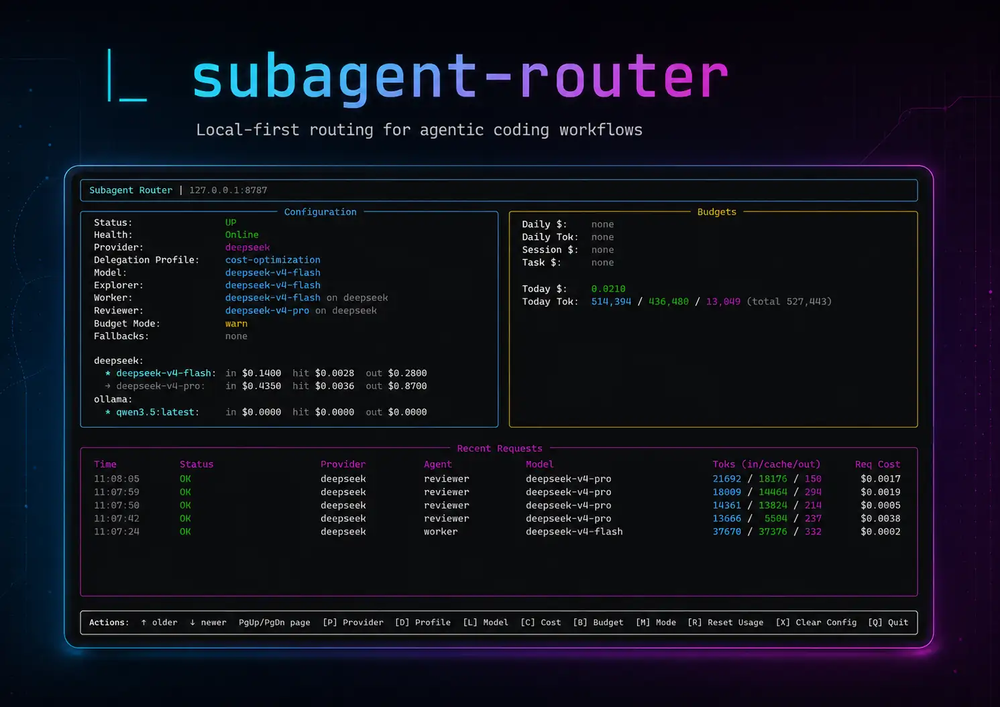

# Subagent Router

<p align="left">
  <a href="https://github.com/marikarX/subagent-router/actions/workflows/ci.yml">
    
  </a>
  <a href="https://github.com/marikarX/subagent-router/blob/main/LICENSE">
    
  </a>
  <a href="https://www.npmjs.com/package/subagent-router">
    
  </a>
</p>

Route subagent work from primary coding agents to local, low-cost, or cloud model backends.

Subagent Router delegates subagent work to alternate model backends such as **DeepSeek**, **Ollama**, **Groq**, and other OpenAI-compatible providers. It adds routing, fallbacks, and budget controls so the parent agent can keep moving without overspending or exposing every task to the same backend.

The current Codex integration talks to this proxy through a local `/v1/responses` HTTP endpoint. The proxy normalizes requests to backend-specific formats, manages streaming SSE, and tracks usage across tasks, sessions, and days.



## At A Glance

- **Best for**: routing subagent work away from the primary coding model
- **Protocols**: Codex `/v1/responses`, OpenAI-style `/v1/chat/completions`
- **Backends**: DeepSeek, Ollama, Groq, vLLM, and other OpenAI-compatible providers
- **Controls**: per-task, per-session, and per-day budget limits
- **Visibility**: structured activity logs and a lightweight TUI

## Start Here

```shell
subagent-router doctor
subagent-router init
DEEPSEEK_API_KEY=... subagent-router start
```

If you just want the shortest path from install to use:

1. Run `subagent-router doctor` to verify your environment.
1. Run `subagent-router init` to install the Codex integration files.
1. Run `subagent-router start` with the provider credentials you want to use.

## Install

From npm:

```shell
npm install -g subagent-router
```

From source:

```shell
cd subagent-router
python -m venv .venv
. .venv/bin/activate
pip install -e '.[server]'
```

## Quick Start

Check your configuration and local paths:

```shell
subagent-router doctor
subagent-router paths
```

Install Codex integration files. This defaults to the `cost-optimization` profile:

```shell
subagent-router init
```

Start the proxy:

```shell
# Foreground
DEEPSEEK_API_KEY=... subagent-router start

# Background
DEEPSEEK_API_KEY=... subagent-router start --background
subagent-router tui --watch
```

Run Codex with an ephemeral proxy:

```shell
DEEPSEEK_API_KEY=... subagent-router run -- codex
```

## Features

- **Multi-provider routing**: switch between DeepSeek, local Ollama, and OpenAI-compatible endpoints.
- **Fallbacks**: retry failed requests on alternate backends.
- **Budget controls**: warn or hard-stop based on token usage or dollar cost per task, session, or day.
- **Observability**: structured audit logs with token tracking, real-time usage metrics, and a lightweight `tui`.
- **Protocol flexibility**: accept Codex Responses requests and standard OpenAI chat-completions payloads.

## Delegation Profiles

Installation profiles control how router subagents are used by the parent coding agent. Pass `--profile` to `subagent-router init` to select one:

| Profile | Default | Parent model role | Delegation style |
|---|---|---|---|
| `cost-optimization` | yes | Minimal coordinator | Best-effort parent token minimization with compact output, retry caps, and selective delegation |
| `deep-delegation` | | Delegation coordinator and final acceptor | Maximizes router offload for exploration, implementation, review, and remediation |
| `orchestrator` | | Primary orchestrator | Keeps broader Codex/GPT-5.5 control while using router agents as bounded helpers |
| `manual` | | Explicit invocation only | Installs provider and role files without global automatic delegation |

`subagent-router init` defaults to `subagent-router init --profile cost-optimization`.
Cost optimization is best-effort and measured through reduced parent Codex token
usage, not wall-clock time. It does not guarantee savings.

Use `subagent-router init --profile deep-delegation` to maximize offload to
router agents for experiments, external review, and quality-through-delegation.
Use `subagent-router init --profile orchestrator` to keep Codex/GPT-5.5 in
broader control. Use `subagent-router init --profile manual`, `--mode opt-in`,
or `--mode provider-only` when you do not want global automatic delegation.

`--profile` only affects `--mode default`. The `opt-in` and `provider-only`
modes install no global profile instructions and print a warning if `--profile`
is also supplied.

Installed agent roles (written to `~/.codex/agents/subagent-router-*.toml` during `init`):

- `subagent_router_explorer` — read-only repo discovery, file mapping, call-path tracing, and scoped technical questions
- `subagent_router_worker` — delegated implementation, refactors, tests, and bounded bug fixes
- `subagent_router_reviewer` — first-pass code review, regression analysis, and implementation critique

See [docs/usage.md](docs/usage.md) for details on each profile and role.

## Configuration

The router can be configured via environment variables or a `config.toml` file.

### Common Environment Variables

- `SUBAGENT_ROUTER_PROVIDER`: Default provider (`deepseek`, `ollama`, `openai-compatible`)
- `SUBAGENT_ROUTER_BUDGET_MODE`: `warn` (default) or `hard-stop`
- `SUBAGENT_ROUTER_MAX_COST_PER_DAY`: Maximum daily spend in USD
- `SUBAGENT_ROUTER_MAX_TOKENS_PER_SESSION`: Token budget for the current session

### Example Config (`config.toml`)

```toml
[providers.groq]
type = "openai-compatible"
base_url = "https://api.groq.com/openai/v1"
model = "llama-3.3-70b-versatile"

[budgets]
max_cost_per_task = 0.05
max_cost_per_day = 5.00
mode = "hard-stop"
```

More configuration details are in [docs/usage.md](docs/usage.md).

## Roadmap

See [docs/ROADMAP.md](docs/ROADMAP.md) for implemented and planned features including intelligent provider scoring and advanced routing policies.

## Documentation

- [Usage and configuration](docs/usage.md)
- [Architecture and behavior](docs/proxy_requirements.md)
- [Protocol notes](docs/protocol_findings.md)
- [Troubleshooting](docs/troubleshooting.md)
- [Provider compatibility](docs/compatibility.md)
- [Test matrix](docs/test_matrix.md)
- [Release checklist](docs/release_checklist.md)
- [Changelog](CHANGELOG.md)

## Development

```shell
uv run pytest
```

Run a mock proxy for local checks:

```shell
subagent-router start --mock --port 8787
curl -sS http://127.0.0.1:8787/health
curl -sS http://127.0.0.1:8787/debug/activity
```

## License

MIT. See [LICENSE](LICENSE).
